<div align="center">
  
# 👋 Hello World, I'm Stefan! 

### 🚀 Full-Stack Developer | 💡 Tech Enthusiast | 🌟 Innovation Seeker


</div>

---

<div align="center">

## 🏆 GitHub Achievements


</div>

---

## 💫 About Me


```javascript
const stefan = {
    location: "🌍 Earth",
    currentFocus: "Building stefanlenta.org",
    learning: ["JavaScript", "Python", "Java", "CCNA", "Advanced Databases"],
    collaboration: "Open to pro bono Python & JS projects",
    askMeAbout: ["JavaScript", "Python", "Full-Stack Development"],
    funFact: "🐋 You can hear a blue whale's heartbeat from over 2 miles away!",
    portfolio: "stefanlenta.org"
};
```

### 🔭 Currently Working On

<details>
<summary>📝 <strong>Personal Blog & Tutorial Platform</strong></summary>
<br>

🚀 Building a comprehensive resource at **[stefanlenta.org](https://stefanlenta.org)**
- 📚 Creating helpful tutorials and guides
- 💻 Developing interactive web applications  
- 🎨 Designing user-friendly interfaces
- 📱 Implementing responsive design principles

</details>

### 🌱 Learning Journey

```mermaid
graph LR
    A[🎯 Current Focus] --> B[JavaScript]
    A --> C[Python] 
    A --> D[Java]
    A --> E[CCNA Networking]
    A --> F[Advanced Databases]
    
    B --> G[🚀 Advanced Frameworks]
    C --> H[🤖 AI/ML Libraries] 
    D --> I[☕ Enterprise Applications]
    E --> J[🌐 Network Security]
    F --> K[📊 Data Optimization]
```



<div align="center">

| 💻 **Language** | 📊 **Progress** | 🎯 **Focus Area** |
|:---:|:---:|:---:|
| **JavaScript** |  | Advanced Frameworks |
| **Python** |  | AI/ML Development |
| **Java** |  | Enterprise Solutions |
| **Networking** |  | CCNA Certification |
| **Databases** |  | Performance Tuning |

</div>

**Alternative Progress Display:**

```
JavaScript   ████████████████████░ 90%  🚀 Advanced
Python       ████████████████████░ 85%  🐍 Proficient  
Java         ███████████████░░░░░░ 75%  ☕ Intermediate
Networking   ████████████░░░░░░░░░ 60%  🌐 Learning
Databases    ████████████████░░░░░ 80%  🗄️ Proficient
```

### 👯 Let's Collaborate

<div align="center">

```diff
+ 🤝 Open to Pro Bono Collaboration
+ 🐍 Python Projects Welcome
+ ⚡ JavaScript Applications
+ 🌟 Open Source Contributions
+ 💡 Innovative Ideas Exchange
```

</div>

<div align="center">
  
[](mailto:stefanlenta@gmail.com)
[](mailto:stefanlenta@gmail.com)
[](mailto:stefanlenta@gmail.com)

</div>

---

## 🛠️ Tech Arsenal

<div align="center">

### 💻 Programming Languages


### 🖥️ Frontend Development


### ⚙️ Backend Development


### 🗄️ Databases


### 🔧 Tools & Technologies


### 📚 Other Skills


</div>

---

## 📊 GitHub Analytics

<div align="center">
  


</div>

<div align="center">
  


</div>

---

## 🌐 Connect With Me

<div align="center">

<a href="https://linkedin.com/in/stefan-lenta">
  
</a>
<a href="https://stefanlenta.org">
  
</a>
<a href="mailto:stefanlenta@gmail.com">
  
</a>
<a href="https://fb.com/stefan%20lenta">
  
</a>

</div>

---

<div align="center">

## 🎯 Goals for 2025

```
📈 Contribute to 50+ open source projects
🔧 Master advanced JavaScript frameworks
🏗️ Build 10 full-stack applications
📚 Complete CCNA certification
🌟 Grow stefanlenta.org community
```

</div>

---

<div align="center">

### 💭 Quote of the Day


</div>

---

<div align="center">

**✨ "Code is like humor. When you have to explain it, it's bad." – Cory House ✨**


</div>
